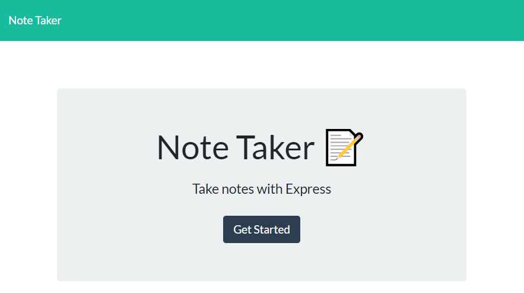
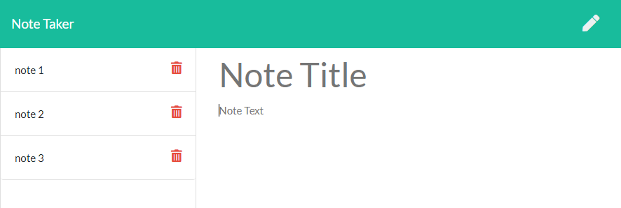

# Note Taker

  ## Description:
  This JavaScript program allows users to add, view, and delete notes.

  ## Links:
  * [Repo](https://github.com/locutusOO1/note_taker)
  * [Deployed on Heroku](https://guarded-wave-08053.herokuapp.com/)

  ## Table of Contents:
  * [Installation](#installation)
  * [Usage](#usage)
  * [Technology Used](#technology-used)
  * [Questions](#questions)
  * [Screenshots](#screenshots)

  ## Installation:
  * Install dependencies by running "npm install" from the terminal.
  
  ## Usage:
  * Run application from the terminal with "node server"
  * Use a browser to visit "http://localhost:8080/"

  ## Technology Used:
  * Node.js - for JS runtime environment
  * Express - for serving
  * File Sytem - for creating and reading files
  * Path - for file paths
  * JS/ES6+ - for program logic
  * HTML - for layout
  * CSS - for style
  * Bootstrap - for responsive design
  * Heroku - for deploying server

  ## Questions:
  * Feel free to checkout my [GitHub Profile](https://github.com/locutusOO1).

  ## Screenshots:
  ### Home Page:

  

  ### Notes Interface:

  

